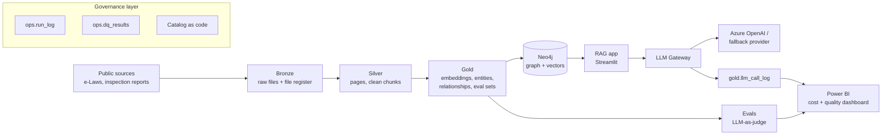

# CareReg Intelligence Platform

A governed data and AI platform that turns Ontario seniors care regulations and public inspection reports into something you can actually ask questions of.

It is built as three AI projects sitting on one shared, governed data foundation:

| # | Project | What it does | Status |
|---|---------|--------------|--------|
| 0 | **Data foundation (EDM)** | Medallion lakehouse, catalog, lineage, data quality, run logging | In progress |
| 1 | **Knowledge Graph RAG** | Builds a regulation knowledge graph in Neo4j and answers questions with cited sources | Planned |
| 2 | **LLM Gateway** | Every model call goes through one service that logs cost, latency and errors, retries and fails over | Planned |
| 3 | **LLM-as-Judge Evals** | Scores answer quality against a hand-labelled gold set and tracks it release over release | Planned |

The point of the build is not just "a chatbot over PDFs". It is showing how an AI feature should sit on top of a data platform that someone could hand to a team and audit.

## Why this domain

Retirement homes and long-term care homes in Ontario are regulated by two large, cross-referencing bodies of law plus thousands of public inspection reports. Questions like "which requirements apply to a home that provides memory care, and which ones show up most in inspection findings?" need relationships, not just keyword search. That is exactly where a knowledge graph beats plain vector RAG.

All source data is public. No employer data, no resident data, no personal information is used anywhere in this project.

## Architecture at a glance



Full detail: [docs/01_architecture.md](docs/01_architecture.md)

## Governance documentation

This repo carries a full governance pack. In a solo portfolio build every role is held by one person, but the pack is written so the platform could be handed to a team and still hold up in an audit.

| Doc | Covers |
|-----|--------|
| [00 Governance charter](docs/00_governance_charter.md) | Purpose, principles, roles, RACI, decision rights |
| [01 Architecture](docs/01_architecture.md) | Layers, components, run modes, design choices |
| [02 Data classification and handling](docs/02_data_classification_and_handling.md) | Classification levels, what can go to an LLM, PII rules |
| [03 Data catalog](docs/03_data_catalog.md) | Every table, column, owner, classification, retention |
| [04 Data quality framework](docs/04_data_quality_framework.md) | Dimensions, rules, severities, what blocks a load |
| [05 Lineage](docs/05_lineage.md) | Record-level lineage from answer back to source page |
| [06 AI governance](docs/06_ai_governance.md) | Model inventory, prompt versioning, eval gates, human review |
| [07 Security and access](docs/07_security_and_access.md) | Secrets, roles, least privilege |
| [08 Retention and lifecycle](docs/08_retention_and_lifecycle.md) | How long everything is kept and how it is removed |
| [09 Change management](docs/09_change_management.md) | Branching, PR checks, environments, releases |
| [10 Cost management](docs/10_cost_management.md) | Budgets, alerts, unit costs, cost per answer |
| [11 Risk register](docs/11_risk_register.md) | Known risks, likelihood, impact, controls |
| [ADRs](docs/adr/) | Why each big decision was made |
| [Runbooks](docs/runbooks/) | What to do when something breaks |

Governance is also enforced in code, not just written down:

- `config/catalog.yaml` is the machine-readable catalog. Every table must have an owner, steward, classification and retention period.
- `config/dq_rules.yaml` holds every data quality rule. The pipeline reads rules from here.
- `tests/test_governance_config.py` fails the build if a table is missing an owner, a rule points at a table that does not exist, or a classification is not in the approved list.

## Running it

Two run modes, same code:

- **Local mode (default, $0):** Delta tables on your own disk, Neo4j AuraDB Free, Azure OpenAI pay-per-token.
- **Fabric mode:** the same Delta tables written to a Fabric lakehouse in OneLake, using the 60 day Fabric trial.

```bash
python -m venv .venv
.venv\Scripts\activate          # Windows
source .venv/bin/activate       # macOS / Linux
pip install -r requirements.txt
copy .env.example .env          # Windows  (cp on macOS / Linux), then fill in keys
pytest                          # governance checks must pass before anything runs
```

## Build roadmap

| Step | Deliverable |
|------|-------------|
| 1 | Repo foundation, governance pack, catalog and DQ rules as code |
| 2 | Bronze ingestion: download sources, file register, run log |
| 3 | Silver: PDF text extraction, cleaning, chunking, DQ checks |
| 4 | Gold: embeddings, entity and relationship extraction |
| 5 | Neo4j graph load and vector index |
| 6 | Retrieval: vector, graph, hybrid, router |
| 7 | Streamlit app with sources and Cypher shown |
| 8 | LLM Gateway with logging, retries, failover |
| 9 | Eval gold set and LLM-as-judge with human calibration |
| 10 | Power BI dashboard, README results, demo video |

## Cost

Target spend for the full build is under $20 USD. See [docs/10_cost_management.md](docs/10_cost_management.md) for the breakdown and the guardrails that keep it there.

## Author

Gaurav, Senior Data Specialist. Built as a portfolio project on public data only.
