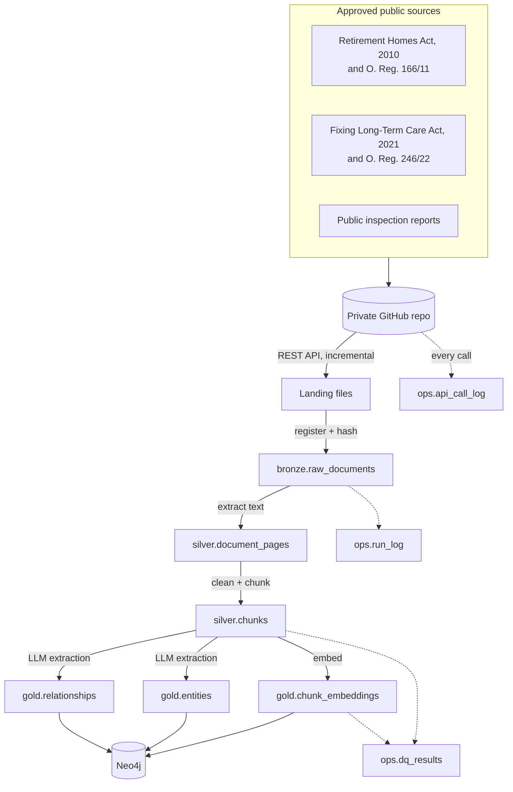
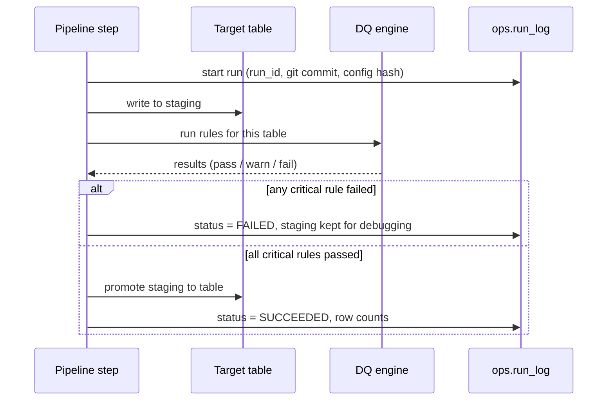

# 01 Architecture

## 1. Layers

| Layer | Holds | Rule |
|-------|-------|------|
| **Source** | Private GitHub repo `care-reg-source-docs`, one folder per source | Read through the GitHub REST API only (ADR-005) |
| **Landing** | Files exactly as downloaded (`data/landing/github/<source>/<commit>/`) | Never edited. Not committed to git. DQ-B-005 checks they still match their hash. |
| **Bronze** | File register: one row per file with hash, size, source and load id | Append only. Duplicate files (same hash) are skipped, not reloaded. |
| **Silver** | Page text and clean chunks | Rebuilt from bronze. Must pass critical DQ rules before gold reads it. |
| **Gold** | Embeddings, entities, relationships, eval sets, LLM call logs | Only thing the apps read. |
| **Ops** | `run_log`, `dq_results` | Written by every pipeline run. Never deleted inside the retention period. |



## 2. Components

| Component | Tech | Cost |
|-----------|------|------|
| Source integration | GitHub REST API, shared HTTP client with retries and rate limits | $0 |
| Storage format | Delta Lake via `deltalake` (delta-rs) Python library | $0 |
| Local query engine | DuckDB | $0 |
| Cloud lakehouse (optional) | Microsoft Fabric lakehouse on OneLake, trial capacity | $0 for 60 days |
| Graph and vector store | Neo4j AuraDB Free | $0 |
| LLM and embeddings | Azure OpenAI: `gpt-4.1-mini`, `text-embedding-3-small` | A few dollars total |
| App | Streamlit | $0 |
| Dashboard | Power BI Desktop | $0 |
| CI | GitHub Actions | $0 on public repos |

## 3. Run modes

The same code runs in two places. The only thing that changes is where Delta tables are written.

| Setting | Local mode | Fabric mode |
|---------|-----------|-------------|
| `LAKEHOUSE_ROOT` | `./data/lakehouse` | `abfss://<workspace>@onelake.dfs.fabric.microsoft.com/<lakehouse>.Lakehouse/Tables` |
| Auth | none | Entra ID token via `azure-identity` |
| Where code runs | Your laptop | Your laptop or a Fabric notebook |

Why this matters: in an interview you can say the platform is not tied to one vendor. The tables are open Delta format and land in OneLake without a code change. See [ADR-001](adr/ADR-001-local-first-delta-lakehouse.md).

## 4. Pipeline flow and promotion gates



## 5. Folder layout

```
care-reg-platform/
  config/          settings, source register, catalog and DQ rules as YAML
  data/
    landing/       raw downloads (git-ignored)
    lakehouse/     Delta tables in local mode (git-ignored)
  docs/            governance pack, ADRs, runbooks
  notebooks/       Fabric notebooks (thin wrappers that call src/)
  src/careplatform package: ingestion, transforms, dq, graph, rag, gateway, evals
  tests/           governance checks and unit tests
```

Notebooks stay thin on purpose. All logic lives in `src/` so it can be tested, reviewed and run anywhere.

## 6. Key design decisions

| ADR | Decision |
|-----|----------|
| [001](adr/ADR-001-local-first-delta-lakehouse.md) | Local-first Delta lakehouse, portable to Fabric |
| [002](adr/ADR-002-neo4j-for-graph-and-vectors.md) | Neo4j for both graph and vector search |
| [003](adr/ADR-003-governance-as-code.md) | Catalog and DQ rules as YAML, enforced by tests |
| [004](adr/ADR-004-no-raw-prompt-logging.md) | Do not store raw user questions in logs by default |
| [005](adr/ADR-005-github-api-as-source.md) | Ingest source documents through the GitHub REST API |
