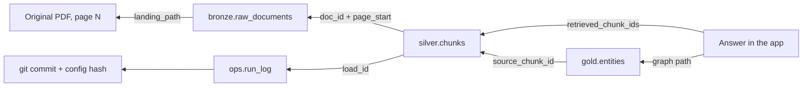

# 05 Lineage

## 1. Two kinds of lineage

| Kind | Answers | How we get it |
|------|---------|---------------|
| **Table-level** | Which tables feed which tables? | Architecture diagram in [01](01_architecture.md), plus Fabric's lineage view in Fabric mode |
| **Record-level** | Which exact source page did this answer come from, and which code run produced it? | Keys carried on every row (below) |

Table-level lineage is what most tools show. It's too coarse for an AI system. When an answer is wrong, you need to know which chunk was retrieved, which page it came from, and which prompt version extracted the entities. That needs record-level lineage.

## 2. The keys

Every row in bronze, silver and gold carries these, and the test suite enforces `load_id` on every one of those tables:

| Key | Lives on | Points to |
|-----|----------|-----------|
| `load_id` | every bronze, silver, gold row | `ops.run_log.run_id`, which has git commit and config hash |
| `doc_id` | bronze, silver | the file, by its SHA-256 |
| `page_start`, `page_end` | `silver.chunks` | pages in the original file |
| `chunk_id` | silver, gold, Neo4j nodes | the chunk |
| `source_chunk_id` | `gold.entities`, `gold.relationships` | the chunk the LLM read to extract it |
| `prompt_version` | gold extraction tables | the exact prompt file used |
| `retrieved_chunk_ids` | `gold.eval_results` | what the retriever returned for that answer |

## 3. Tracing an answer back to source



Example trace query (DuckDB, step 3 onward):

```sql
SELECT c.chunk_id, c.section_ref, c.page_start, b.file_name, b.source_url,
       r.git_commit, r.config_hash, r.started_at
FROM silver.chunks c
JOIN bronze.raw_documents b ON b.doc_id = c.doc_id
JOIN ops.run_log r         ON r.run_id = c.load_id
WHERE c.chunk_id = :chunk_id;
```

## 4. In Neo4j

Every `Chunk` node stores `chunk_id`, `doc_id`, `page_start` and `load_id`. Every entity node has a `MENTIONED_IN` edge to the chunks it came from. So a graph answer can always show its source pages.

## 5. What the app shows

Every answer shows its sources as `file name, section, page`. If the app cannot show a source, it does not give the answer. See answer policy in [06](06_ai_governance.md).
