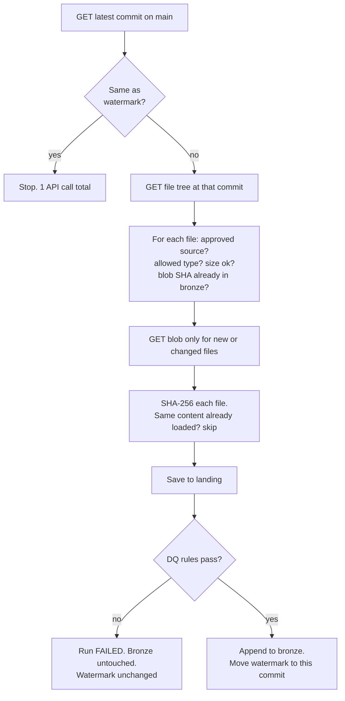

# 12 Integration Standards

Rules every source connector must follow. The GitHub connector (`src/careplatform/connectors/github.py`) is the reference implementation, built on the shared client in `connectors/http.py`.

## 1. Why a standard

Every API fails in the same handful of ways: it's slow, it's down for a minute, it rate limits you, it changes pages, or your token expires. If each connector handles those differently, you get pipelines that work in testing and break at 3am. So all connectors share one client, and that client handles the failure cases once, properly.

## 2. The rules

| # | Rule | How it's enforced |
|---|------|-------------------|
| I-1 | Every request has a timeout | `http.timeout_seconds` in settings; test `test_every_request_has_a_timeout` |
| I-2 | Retry only what can succeed on retry: 429, 500, 502, 503, 504, dropped connections | `RETRY_STATUSES` in `http.py`; tests cover retry and no-retry cases |
| I-3 | Back off exponentially with jitter (1s, 2s, 4s, 8s...) | `_backoff()`; test checks the wait times |
| I-4 | Respect the server: `Retry-After`, and wait for `X-RateLimit-Reset` when the limit is used up | `_wait_seconds()`; tests for both |
| I-5 | Give up clearly. After max retries, or if a rate limit reset is too far away, fail with a message that says what to do | `ApiError` messages |
| I-6 | Follow pagination to the end, never assume one page | `paginate()` follows `Link: rel="next"` |
| I-7 | Log every attempt to `ops.api_call_log`, including failed ones and retries | `_record()` and `flush_log()`, flushed even when the run fails |
| I-8 | Never log secrets or query strings | Only the path is logged; test asserts the token isn't in the log |
| I-9 | Least privilege auth: read-only, scoped to the one resource | Fine-grained token, Contents read-only, one repo |
| I-10 | Incremental by default: use a watermark and content hashes so reruns are cheap and safe | `ops.watermarks`, Git blob SHA check |
| I-11 | Move the watermark only after data is written and DQ passed | `bronze_ingest.run()` order; test `test_dq_failure_blocks_load_and_keeps_watermark` |
| I-12 | Gate early, check late. Don't download data from unapproved sources, and still check at the end in case the gate had a bug | `plan()` skips unapproved sources; DQ-B-004 as backstop |
| I-13 | Tests never hit the real API | `tests/fakes.py` fake GitHub; CI is fast, free and doesn't need a token |

## 3. How incremental loading works here

Two different hashes, two different jobs:

| Hash | Computed by | Used for |
|------|-------------|----------|
| Git blob SHA (SHA-1) | GitHub, before download | Skip unchanged files without downloading them |
| SHA-256 of the bytes | Us, after download | `doc_id`, the platform's own content ID, independent of GitHub |

Why not only use the blob SHA? Because `doc_id` must mean the same thing whatever connector brought the file in. If we later add a SharePoint or S3 connector, the same PDF gets the same `doc_id`.

## 4. Rate limits (GitHub)

| Auth | Limit |
|------|-------|
| No token | 60 requests per hour per IP |
| Personal access token | 5,000 requests per hour |

A full first load of this repo is roughly 2 + number of files requests, so well under either limit. `ops.api_call_log.rate_limit_remaining` shows how close you got.

## 5. Adding a new connector

1. Create `connectors/<name>.py` using `ApiClient` (don't use `requests` directly)
2. Add a `source_system` value and its watermark scope
3. Add fakes for its endpoints in `tests/fakes.py` and tests for first load, rerun, change, failure
4. Add its token to `.env.example` and the secrets table in [07](07_security_and_access.md)
5. Write an ADR if it changes the architecture
