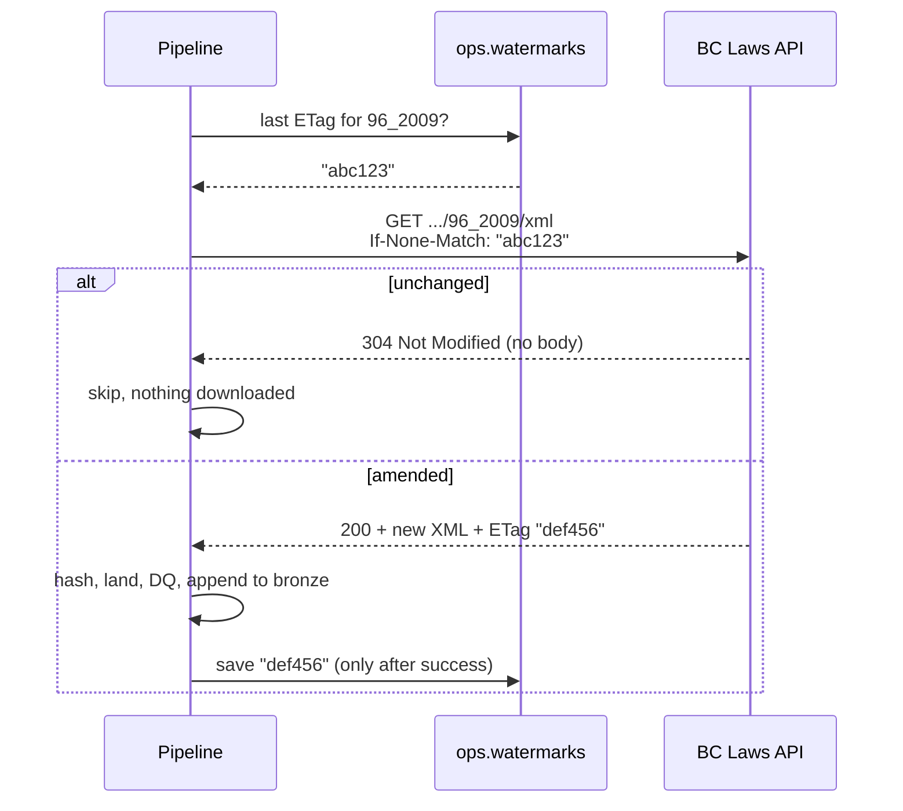
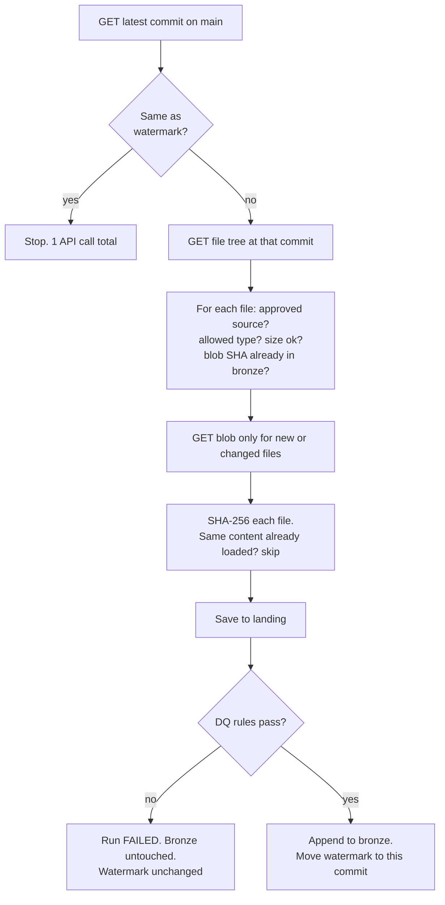

# 12 Integration Standards

Rules every source connector must follow. There are two connectors today, and they show two different sides of API integration:

| | BC Laws (`connectors/bclaws.py`) | GitHub (`connectors/github.py`) |
|--|--|--|
| Province | British Columbia | Ontario |
| Auth | None, public API | Fine-grained token |
| How we know what changed | HTTP conditional request (ETag, 304 Not Modified) | Latest commit SHA as watermark, Git blob SHA per file |
| Fallback | Content hash if the server ignores ETags; HTML if XML is missing | Full refresh flag |
| Format | XML | PDF, HTML, text |

Both use the shared client in `connectors/http.py` and follow the contract in `connectors/base.py`.

## 1. Why a standard

Every API fails in the same handful of ways: it's slow, it's down for a minute, it rate limits you, it changes pages, or your token expires. If each connector handles those differently, you get pipelines that work in testing and break at 3am. So all connectors share one client, and that client handles the failure cases once, properly.

## 2. The rules

| # | Rule | How it's enforced |
|---|------|-------------------|
| I-1 | Every request has a timeout | `http.timeout_seconds` in settings; test `test_every_request_has_a_timeout` |
| I-2 | Retry only what can succeed on retry: 429, 500, 502, 503, 504, dropped connections | `RETRY_STATUSES` in `http.py`; tests cover retry and no-retry cases |
| I-3 | Back off exponentially with jitter (1s, 2s, 4s, 8s...) | `_backoff()`; test checks the wait times |
| I-4 | Respect the server: `Retry-After`, and wait for `X-RateLimit-Reset` when the limit is used up | `_wait_seconds()`; tests for both |
| I-5 | Give up clearly. After max retries, or if a rate limit reset is too far away, fail with a message that says what to do | `ApiError` messages |
| I-6 | Follow pagination to the end, never assume one page | `paginate()` follows `Link: rel="next"` |
| I-7 | Log every attempt to `ops.api_call_log`, including failed ones and retries | `_record()` and `flush_log()`, flushed even when the run fails |
| I-8 | Never log secrets or query strings | Only the path is logged; test asserts the token isn't in the log |
| I-9 | Least privilege auth: read-only, scoped to the one resource | Fine-grained token, Contents read-only, one repo |
| I-10 | Incremental by default: use a watermark and content hashes so reruns are cheap and safe | `ops.watermarks`, Git blob SHA check |
| I-11 | Move the watermark only after data is written and DQ passed | `bronze_ingest.run()` order; test `test_dq_failure_blocks_load_and_keeps_watermark` |
| I-12 | Gate early, check late. Don't download data from unapproved sources, and still check at the end in case the gate had a bug | `plan()` skips unapproved sources; DQ-B-004 as backstop |
| I-13 | Tests never hit the real API | `tests/fakes.py` fakes for GitHub and BC Laws; CI is fast, free and doesn't need a token |
| I-14 | Be polite to public APIs: identify yourself with a User-Agent, one request per document, conditional requests, no parallel hammering | `bclaws.user_agent` in settings; BC connector is sequential |
| I-15 | Isolate failures: each connector is its own run. One source being down never blocks another | `run_all()`; test `test_one_connector_failing_does_not_block_the_other` |
| I-16 | Every connector follows the same contract: `fetch()` returns items, skip reasons and watermarks. It never writes to bronze itself | `connectors/base.py` |

## 3. Conditional requests (BC Laws)

GitHub hands us a commit SHA, so "did anything change?" is one cheap call. Most public APIs don't have that. The web's built-in answer is **HTTP conditional requests**:

1. The first time we download a document, the server sends back an `ETag` (a fingerprint of that version) and a `Last-Modified` date.
2. We save both as the watermark for that document in `ops.watermarks`.
3. Next run we send them back as `If-None-Match: <etag>` and `If-Modified-Since: <date>`.
4. If the document hasn't changed, the server answers **304 Not Modified** with no body. We skip it.
5. If it changed, we get **200** with the new version and a new ETag.

**What if the server ignores ETags?** Then it always sends 200 with the full document. We still don't store duplicates, because the pipeline hashes the bytes and skips content already in bronze. That costs bandwidth but never correctness. The test `test_server_without_caching_falls_back_to_content_hash` proves it.

## 4. How incremental loading works for GitHub

Two different hashes, two different jobs:

| Hash | Computed by | Used for |
|------|-------------|----------|
| Git blob SHA (SHA-1) | GitHub, before download | Skip unchanged files without downloading them |
| SHA-256 of the bytes | Us, after download | `doc_id`, the platform's own content ID, independent of GitHub |

Why not only use the blob SHA? Because `doc_id` must mean the same thing whatever connector brought the file in. If we later add a SharePoint or S3 connector, the same PDF gets the same `doc_id`.

## 5. Rate limits (GitHub)

| Auth | Limit |
|------|-------|
| No token | 60 requests per hour per IP |
| Personal access token | 5,000 requests per hour |

A full first load of this repo is roughly 2 + number of files requests, so well under either limit. `ops.api_call_log.rate_limit_remaining` shows how close you got.

## 6. Adding a new connector

1. Create `connectors/<name>.py`: subclass `SourceConnector`, use `ApiClient` (never `requests` directly), implement `fetch()`
2. Add it to `build_connector()` in `bronze_ingest.py` and to `enabled_connectors` in settings
3. Add its required source fields to `CONNECTOR_FIELDS` in `governance/validate.py`, and its name to DQ-B-008
4. Add fakes for its endpoints in `tests/fakes.py` and tests for first load, rerun, change, failure
5. Add its token (if any) to `.env.example` and the secrets table in [07](07_security_and_access.md)
6. Write an ADR
